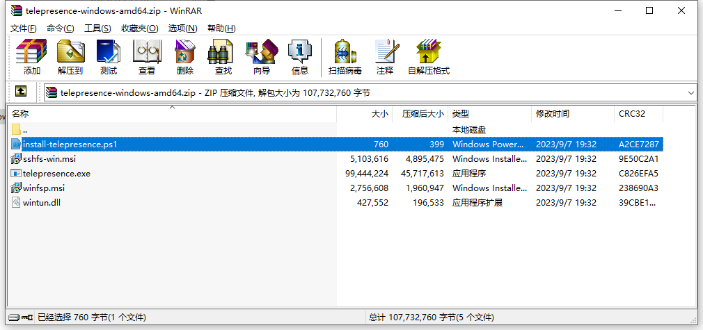
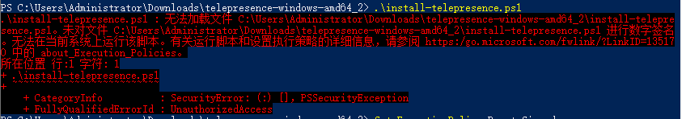
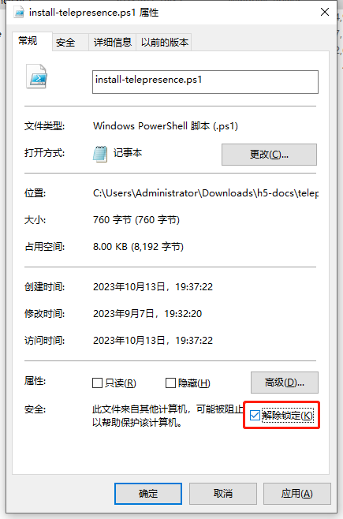

## Telepresence 简介

Telepresence 是一款云原生调试工具，是 CNCF 基金会项目之一。它通过代理的方式，让开发人员可以在本地直接访问集群服务，同时也能够对发送到集群服务的流量进行拦截，转发到在本地进行调试。它是我们在云原生开发过程中的一件调试利器。

Telepresence 的安装和使用说明可以参考官方[快速指南](https://www.telepresence.io/docs/latest/quick-start/)。文本试图围绕 Telepresence 原理、安装和使用过程中的常见问题，给出一定的辅助指引。

## Telepresence 原理概要

::: info
待补充
:::

## 安装注意事项

### 客户端安装

#### Windows 安装注意事项

Windows 系统可以使用 Powershell 进行安装，我们可以在 GitHub 上下载安装包进行安装。

安装包名如 `telepresence-windows-amd64.zip`，里面的内容大概是这些：



安装 Telepresense，原则上我们只需要在解压后进入目录，然后运行 `./install-telepresence.ps1` 即可进行安装。但很多时候第一次安装会遇到这样的报错：



报错的内容说未对脚本文件进行数字签名，所以无法在当前系统上运行。这个问题参考以下两个步骤进行处理。

1. 查看和调整脚本运行策略

首先我们需要用***管理员身份**运行 Powershell，然后我们先查看脚本运行策略，如果当前策略不是 `RemoteSigned`，则执行命令把策略设置为 `RemoteSigned`。

```powershell
# 注意要用管理员身份运行 powershell

# 查看策略
Get-ExecutionPolicy

# 修改策略
Set-ExecutionPolicy RemoteSigned
```

2. 解除脚本锁定状态

设置好系统脚本执行策略后，我们右键点击安装脚本，选择“属性”，然后确保“解除锁定”选项为勾选状态，然后保存。



经过这两个步骤设置后，再次执行 `./install-telepresence.ps1` 命令即可顺利安装 Telepresence 客户端。

### 集群端代理安装

安装好客户端之后，就可以使用 telepresence 命令安装集群代理。

telepresence 集群代理的安装命令是对 `helm` 做了一层封装，安装的时候也能支持自定义 `values.yaml` 文件。我们也可以根据以往使用 `helm` 安装第三方包的经验进行安装。

以下为一种常规的安装方式示例。

```bash
# 1. 首先我们考虑将 helm 的默认 values.yaml 下载下来，便于对比调整。

# 添加仓库
helm repo add datawire https://app.getambassador.io

# 指定好版本号，将默认的 values.yaml 下载到本地，这里命名为 values-default.yaml 便于区分。
# 要注意这里的版本号，一般与客户端保持一致，比如你在 Github 下载的版本是 2.16.1，那这里就指定 2.16.1 的 chart 版本。
helm show values datawire/telepresence --version 2.16.1 > values-default.yaml

# 2. 下载了默认配置之后，我们可以对比着，把要调整的配置项写到自定义的 values.yaml 文件中。
# 如果集群节点无法直接访问 docker.io，这里我们就要把镜像地址调整下。
# 比如华为云CCE弹性节点一般是没有公网IP可以直连 docker.io 的，那么我就要把镜像上传到华为云SWR私仓上，然后把 image.registry、hooks.curl.registry、agent.imageregistry 都设置为SWR的地址。

# 3. 接下来就可以指定配置文件进行安装了
telepresence helm install --values ./values.yaml --kubeconfig="C:\\Users\\Administrator\\.kube\\kubeconfig.yaml"

# 安装后，如果调整了配置，可以使用 upgrade 命令进行更新
telepresence helm upgrade --values ./values.yaml --kubeconfig="C:\\Users\\Administrator\\.kube\\kubeconfig.yaml"

# 可以使用 uninstall 命令进行卸载
telepresence helm uninstall --kubeconfig="C:\\Users\\Administrator\\.kube\\kubeconfig.yaml"
```

这里要注意一点，`telepresence helm` 命令默认超时时间是 30s，如果集群访问仓库比较慢，是有可能不够时间把服务安装完的。如果要出现超时，可以到 `C:\Users\Administrator\AppData\Roaming\telepresence\config.yml` 上进行配置，如果没有此文件新建即可。比如设置 timeouts.helm=60，即设置超时时间为 1 分钟。

## 日常使用

### 连接到集群

日常开发进行调试的时候，可以轻松使用 telepresence 连接到集群环境。接入后就可以在本地无缝地以 `Service` 域名访问服务了，非常便利。而要退出集群的时候，也可以使用命令退出代理。

```bash
# 连接到集群
# telepresence 默认会把发往 Service 域名的请求代理到集群，而使用 also-proxy 参数可以将发往其他地址的请求也代理到集群里。
# 比如数据库如果独立于集群进行部署，同时用内网地址进行访问，那么就可以将对应网段或固定IP进行额外代理。
# ***现在可以单方面请求其他集群内部服务进行调试了***
telepresence connect --also-proxy 172.16.1.0/24 --kubeconfig="C:\\Users\\Administrator\\.kube\\kubeconfig.yaml"

# 退出连接
# 使用以下命令退出代理模式
telepresence quit
```

### 拦截服务请求到本地

使用 `intercept` 命令可以将发往集群服务的请求拦截到本地进行调试，是前后端进行云原生联调的利器。注意拦截时如果没有连接到集群，会自动进行接入，建议提前自定参数接入集群。

```bash
# 可以指定命名空间查看可以拦截的服务
telepresence list -n namespace1

# 使用 intercept 命令对发往 Deployment 的请求进行拦截
# port 参数指定本地接收请求的端口，可以和集群中服务的端口不同
# 注意这里拦截成功会回显 Intercept name，我们后续要用这个名字退出拦截，这个名字默认为deployment和命名空间的组合。
# ***现在可以愉快的进行前后端本地联调了***
telepresence intercept deployment1 --namespace namespace1 --port 8888

# 退出拦截
# 使用 Intercept name 进行退出拦截。如果不确定这个名字，可以通过 telepresence list 命令进行查询
telepresence leave deployment1-namespace1

# telepresence 拦截服务请求时会在 Pod 里安装代理容器，如果不需要了，可以将代理容器删除。
# 以下为删除所有代理容器的示例
telepresence uninstall --all-agents
```
